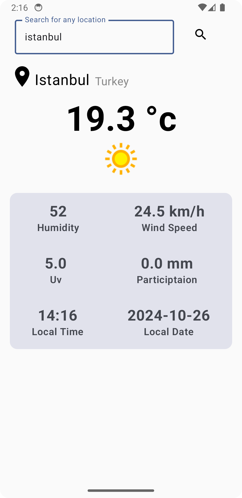

# WeatherApp
Kotlin, Jetpack Compose, Retrofit, Coil kullanarak yapılmış, MVVM mimarisine uygun bir şekilde oluşturulmuş bir hava durumu uygulamasıdır.

## İzlenilen Kaynak
- [YouTube Kaynağı](https://www.youtube.com/watch?v=Kn6vUH1uJT4&t=120s)
  
## Kullanılan Teknolojiler
- Kotlin
- Jetpack Compose
- Retrofit
- Coil
- MVVM Mimarisi

## Ekran Görüntüleri

